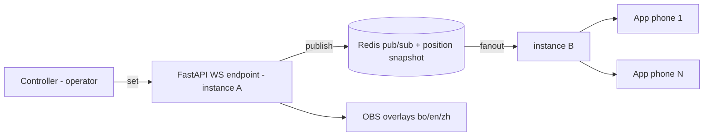

# RFC: Live Recitation Sync (segment-keyed auto-scroll)

| Field | Value |
|-------|-------|
| **Status** | Proposed |
| **Date** | 2026-09-14 |
| **Scope** | WeBuddhist-Backend, mobile client, OBS overlay repo |
| **Related** | `segments.md`, `rfc-realtime-comments.md`, `rfc-event-rooms-and-prayers.md`, `pecha_api/chat/chat_websocket.py` |

---

## 1. Summary

One operator advances a puja on a controller. The current position is broadcast to every subscriber of that
event: the **OBS language overlays** (bo / en / zh) burn it into the livestream, and the **WeBuddhist app**
scrolls the liturgy on each in-person attendee's phone, lyrics-style, so people in the room read along
without watching video.

The broadcast payload is **one segment id plus a round counter**. Nothing else. The service never sends text.

---

## 2. The core decision: `segment_id` is the wire key

The prototype broadcasts a bare array `index` into a flattened `content.json`. That breaks the moment the
liturgy is edited — every client after the edit point scrolls to the wrong line — and it gives the app no way
to know *which* line to highlight in the reader's own language.

We already have the right identifier. Per `segments.md`, every segment is its own document with a stable UUID
`id`, a `text_id`, and a `mappings` list linking it to its translations. So:

- **`segment_id` is what we broadcast.** Stable across content edits, and already the app's unit of rendering.
- **Language is a client concern.** The app resolves `segment_id` to the segment in the user's chosen
  translation through the existing `mappings`, and scrolls to that. Three languages, one message.
- **No new id scheme and no shared vocabulary to keep in sync**, which was the open question in the prototype
  design. The contract is the segment collection, which both sides already read.

`index` stays in the payload as an **advisory** ordinal so the existing OBS overlays keep working unchanged
during migration. It is not authoritative. New clients must key off `segment_id`.

### 2.1 Naming: not `pass`

The prototype calls the 21-Taras loop counter `pass`. That is a Python keyword, so `pass: int` is a syntax
error and it cannot be a Pydantic field name without an alias. Use **`round_number`** on the wire and in
Python (`round` is a builtin; avoid shadowing it). Rename once, here, before clients bake it in.

---

## 3. Architecture

Mirrors the existing chat stack — nothing new is introduced.



Redis pub/sub is what makes this safe on Render: the load balancer assigns each socket to a **random**
instance with no sticky sessions, so in-process state alone would desync half the room the moment we run more
than one instance. `ChatBroadcaster` already solves this; we copy it.

---

## 4. Endpoint and protocol

Follows the convention in `websocket-client-integration.md`:

```
wss://{host}/api/v1/events/{event_id}/recitation/live?token={auth_token}
```

### 4.1 Operator to server

```json
{ "type": "set", "segment_id": "e47b3b6a-6c4a-4c9f-80d9-8aa632c42b44", "index": 12, "round_number": 3 }
```

Rejected with `FORBIDDEN` unless the caller is the event's operator (section 8). Subscribers that send `set`
are ignored, not disconnected.

### 4.2 Server to all subscribers

```json
{
  "type": "position",
  "event_id": "550e8400-e29b-41d4-a716-446655440000",
  "segment_id": "e47b3b6a-6c4a-4c9f-80d9-8aa632c42b44",
  "index": 12,
  "round_number": 3,
  "server_time": "2026-09-14T09:30:00Z"
}
```

Sent on every change, **and once immediately on connect**, so a late joiner or a reconnecting phone lands on
the live line. There is no catch-up-by-replaying-history: position is a single current value.

### 4.3 Other frames

| Type | Direction | Notes |
|------|-----------|-------|
| `ping` / `pong` | both | 30s heartbeat. Phones sleep; this is how we notice |
| `error` | server to client | `{type, code, message}`, codes as in the comments WS: `VALIDATION_ERROR`, `INVALID_MESSAGE`, `FORBIDDEN`, `SERVER_ERROR` |
| `session_ended` | server to all | Operator closed the puja; clients stop auto-scrolling and release the socket |

Malformed JSON and unknown `type` values are ignored, matching the prototype and the existing endpoints.

---

## 5. `RecitationBroadcaster`

New `pecha_api/events/recitation_websocket.py`, structured like `ChatBroadcaster`:

- Local map `{event_id: {user_id: websocket}}`
- Channel `recitation:event:{event_id}:position`
- `broadcast_position(event_id, segment_id, index, round_number)` publishes, and every instance relays to its
  own local sockets

### 5.1 The one addition over chat: a position snapshot

Chat is a stream of events; this is a **current value**. A phone connecting 40 minutes into a puja must get
the live line, and an instance restarted by a deploy must not lose the operator's place.

So every `set` also writes a Redis hash:

```
KEY  recitation:event:{event_id}:state
     segment_id, index, round_number, updated_at
TTL  12h, refreshed on write
```

On connect, the endpoint reads this key and sends the `position` frame from it. That is one extra `HSET` per
operator click — a handful per minute. This is what makes reconnection and redeploy survivable.

---

## 6. App behavior on `position`

- Scroll the line for `segment_id` to the focus position, smooth-animated; highlight it, dim the rest.
- Show `round_number` during the 21-Taras loop. The same segments repeat and only the counter advances, so
  `segment_id` alone is ambiguous there and the counter is what tells the reader which round they are in.
- **Operator jumps** (clicking any line) arrive as an ordinary `position`; treat them as a scroll, not a
  special case. Make no client-side assumption that position advances monotonically.
- **Follow toggle.** If the user scrolls away to read ahead, drop out of follow mode and show a resync button
  that snaps back to the live segment. Auto-scrolling someone who is deliberately reading ahead is the single
  most annoying failure mode here.
- If `segment_id` is not present in the loaded text (stale content), do not throw. Hold the last good position
  and surface a quiet "out of sync" affordance.
- Reconnect with exponential backoff; the `position` frame on connect resyncs. Never assume order was kept.

---

## 7. Hosting note

Render imposes no connection limit; the ceiling is instance CPU and RAM. For a room of hundreds of phones with
a ~200-byte payload sent a few times a minute this sits far below any meaningful limit — Standard (`1c-2g`) is
adequate, and the shared-Redis design means scaling out later is safe.

Two operational facts matter more than capacity:

- **A deploy drops every socket.** Freeze deploys during a live puja. Client reconnect is mandatory rather than
  nice to have, and section 5.1 is what makes it correct.
- Set `perMessageDeflate: false` on any Node overlay bridge — per-connection zlib buffers dwarf our payload.

---

## 8. Permissions

| Action | Rule |
|--------|------|
| Subscribe | Caller may view the event — reuses the event-room eligibility gate, so no new permission concept |
| Publish (`set`) | Caller is the event's designated operator. v1: event owner or group admin |
| Rate limit | Publishes throttled per event (e.g. 10/s); excess dropped silently |

`event_id` is validated server-side on connect; an unknown or unpublished event closes the socket.

---

## 9. Non-goals (v1)

- Audio playback or word-level karaoke timing. This is line-level and operator-driven.
- Multiple simultaneous operators, or handoff between operators mid-puja.
- Persisting a recitation history, or replaying a past puja.
- Per-user position (bookmarks). This is a shared live position only.
- Serving liturgy text over the socket. The app loads text through the existing segment APIs.

---

## 10. Acceptance criteria

**Backend**
- `wss://.../events/{event_id}/recitation/live` accepts subscribers and sends a `position` frame on connect.
- Non-operator `set` is ignored; operator `set` fans out to every instance via Redis.
- Position survives an instance restart (snapshot key) and expires after 12h.
- Malformed frames are ignored; `ping`/`pong` keeps sockets alive through a multi-hour puja.

**App**
- Auto-scrolls and highlights by `segment_id` in the user's selected language.
- `round_number` is displayed during the Taras loop.
- Follow toggle and resync button work; reconnect resyncs without a manual reload.

**Overlay**
- Existing OBS overlays keep rendering from `index` against the hosted endpoint with no rewrite.

---

## 11. Open questions

- Who is the operator in practice — the event owner, or an explicit role on the event record?
- Does the controller stay a standalone page, or move into Studio?
- One puja at a time per group, or several concurrently? The design supports concurrent events by `event_id`;
  the question is whether the UI needs it.
- In-room wifi: assume flaky and tolerate it (the design does), or is venue networking guaranteed?
